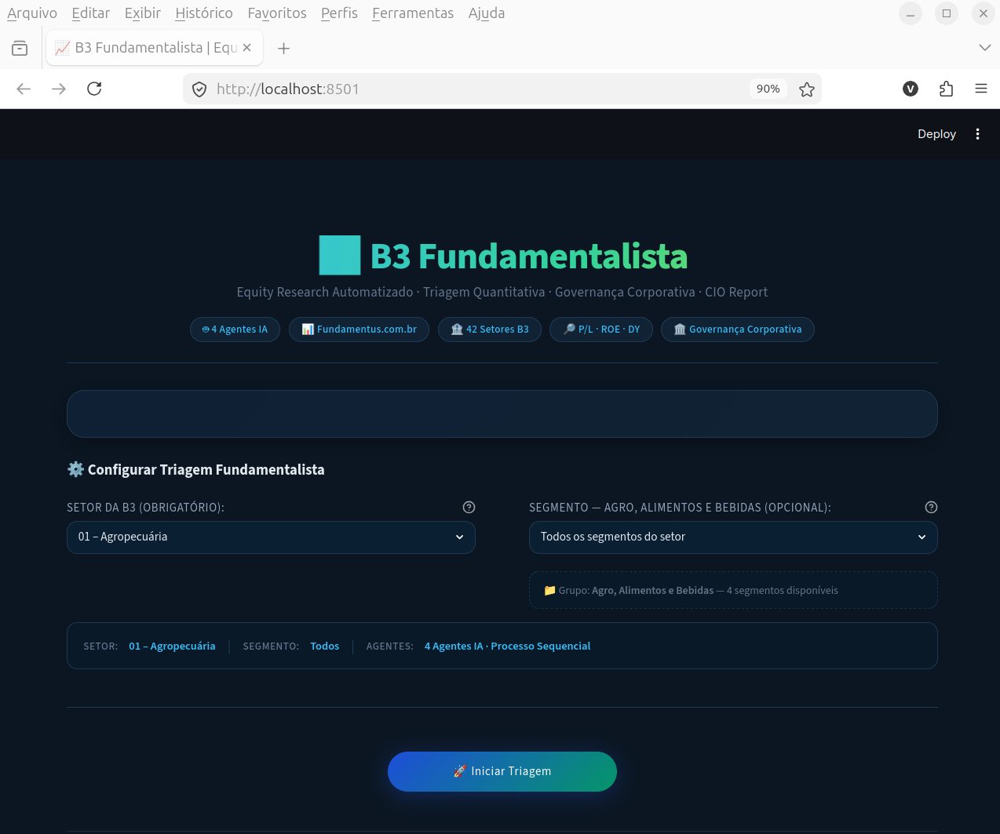

# B3 Fundamentalist Screener
### Engenharia Agêntica


Tela inicial

## Visão geral
Plataforma web que automatiza todo o fluxo de pesquisa fundamentalista de ações listadas na B3. A partir da seleção de **setor** e **subsetor**, quatro agentes de IA (CrewAI) realizam:

1. **Triagem quantitativa** – coleta dados reais de preço/lucro, ROE, Dividend Yield etc. via *fundamentus.com.br* e devolve os **5 melhores tickers**.
2. **Auditoria temporal** – verifica a consistência histórica do ROE e o crescimento de receita nos últimos 5 anos.
3. **Investigação de governança** – analisa free‑float, risco estatal e nível de governança (Novo Mercado, Nível 2, etc.).
4. **Relatório final (CIO)** – consolida as análises em um relatório executivo em Markdown com ranking, justificativas e recomendações de investimento.

Tudo isso ocorre com **uma única interação** na interface Streamlit, exibindo logs em tempo real e entregando um documento pronto para comitês de investimento.

---

## Tecnologias utilizadas

| Camada | Tecnologia | Motivo da escolha |
|--------|------------|-------------------|
| **Frontend** | **Streamlit** (Python) | Criação rápida de UI interativa, suporte a tema escuro e fácil integração com código Python. |
| **Estilização** | CSS customizado (glassmorphism, gradientes, tipografia *Inter* da Google Fonts) | Design premium, responsivo e com micro‑animações que dão “wow” ao usuário. |
| **Orquestração de agentes** | **CrewAI 0.11.2** (padrão *Task Factory*) | Permite definir agentes especializados e sequenciar tarefas sem necessidade de `inputs=` (compatível com a versão instalada). |
| **Modelo de linguagem** | **langchain‑openai 0.0.5** + **OpenRouter** (modelo *Gemini 2.5 Flash*, configurado `max_tokens=4000`, `temperature=0.1`) | LLM de alta performance, custo controlado e suporte a cabeçalhos personalizados. |
| **Aquisição de dados financeiros** | **fundamentus** (pacote Python) | API que raspa de forma estruturada o portal *fundamentus.com.br*, entregando tabelas de P/L, ROE, DY, crescimento de receita etc. |
| **Ferramentas customizadas** | `FundamentusScreenerTool`, `AuditorHistoricoTool`, `InvestigadorGovernancaTool` (subclasse de `BaseTool` do LangChain) | Garantem que o Triador, Auditor e Investigador trabalhem com dados reais e regras de negócio claras, eliminando falhas de buscas genéricas. |
| **Gerenciamento de ambiente** | **virtualenv** (`.venv`) + **pip** | Isolamento das dependências do projeto, facilitando replicação e implantação. |
| **Persistência de credenciais** | Arquivo `keys.txt` (Serper API + OpenRouter API) | Leitura simples via `config.carregar_chaves()`, mantendo as chaves fora do código. |
| **Versionamento** | Estrutura de pastas `agents.py`, `tasks.py`, `tools.py`, `config.py`, `app.py` | Organização modular que permite extensão rápida (novos setores, novas métricas ou mudança de LLM). |

---

## Diferenciais do projeto

- **Dados estruturados e confiáveis** – todas as métricas vêm diretamente do *fundamentus*, sem depender de snippets de busca que costumam ser incompletos.
- **Pipeline totalmente automatizado** – o usuário clica em “Iniciar Triagem” e, em poucos segundos, recebe o ranking final.
- **Design avançado** – UI em dark‑mode com glassmorphism, tipografia premium e animações suaves, proporcionando uma experiência de alto nível visual.
- **Escalabilidade** – a arquitetura baseada em agentes e ferramentas facilita a inclusão de novos indicadores (ex.: valuation, métricas ESG) ou a migração para outros provedores de dados.
- **Controle de custos** – `max_tokens=4000` e temperatura baixa garantem respostas objetivas e evitam consumo excessivo de créditos da API OpenRouter.

---

## Executando a aplicação

### 1️⃣ Preparar o ambiente
```bash
# Acesse a pasta do projeto, exemplo:
cd /home/vsvasconcelos/agents/fundamentalista
python3 -m venv .venv            # cria o virtual‑env
source .venv/bin/activate        # ativa
pip install -r requirements.txt  # instala as dependências
```

### 2️⃣ Configurar as credenciais
Crie (ou edite) o arquivo **`keys.txt`** na raiz do projeto com duas linhas:
```
<SEPER_API_KEY>
<OPENROUTER_API_KEY>
```
Deixe a linha vazia caso não use um dos serviços.

### 3️⃣ Iniciar a aplicação
```bash
streamlit run app.py
```
A interface será aberta em `http://127.0.0.1:8501`.

### 4️⃣ Usar a ferramenta
1. Selecione o **Setor** e **Subsetor** desejado.
2. Clique em **“Iniciar Triagem”**.
3. Acompanhe os logs dos quatro agentes (Triador → Auditor → Investigador → CIO).
4. O **Ranking Final** será exibido em Markdown logo abaixo.

---

**Pronto!** Agora a aplicação está pronta para ser utilizada e apresentada no seu portfólio.


----
# Exemplo de relatório de saída
O arquio [relatorio_b3_bancos_bancos](relatorio_b3_bancos_bancos.md) ilustra um exemplo da saída do sistema para o caso de bancos.
